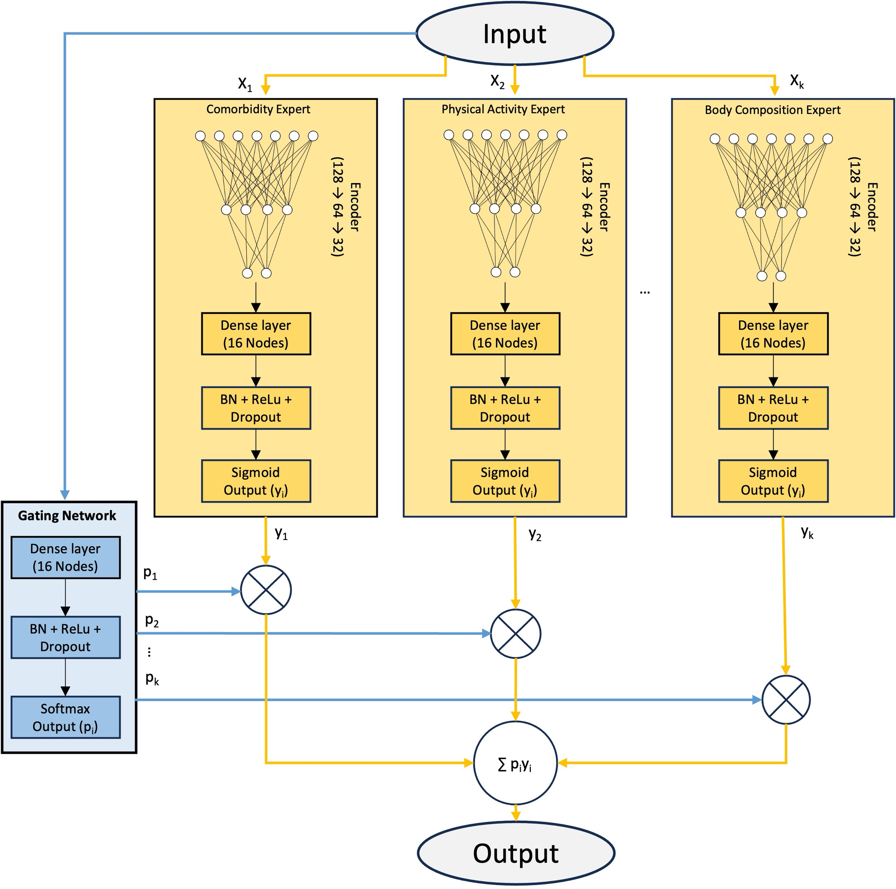

# Deep Transfer Learning for Population-Specific ADRD Risk


> This repository contains the code and model architecture for the paper: **Population-Specific Risk Prediction for Alzheimer's Disease and Related Dementia in Racial Minority Groups Using Deep Transfer Learning**.

A mixture-of-experts deep transfer learning framework for identifying population-specific ADRD risk factors in racial minority groups, with an interactive R Shiny calculator for clinical use.

**Try the calculator:** https://gouravvelma.shinyapps.io/psdrs-dementia-calculator

---

## Overview

Most dementia risk tools are developed predominantly on White European populations, limiting their applicability to minority groups. This work uses a **Mixture-of-Experts (MoE) model with deep transfer learning** to identify population-specific ADRD risk factors for Black and Asian populations by borrowing information from the larger White UK Biobank cohort.

The MoE model ranks and identifies the top contributing features per population using SHAP and Integrated Gradients. These features are then used to develop population-specific Cox Proportional Hazards risk scores (PS-DRS), outputting an interpretable 0–100 Sullivan-style score with 5-, 10-, and 15-year dementia risk probabilities.

### Study Populations (UK Biobank)

| Population | Training N | Dementia Cases |
|:-----------|----------:|---------------:|
| White      | 472,363   | 7,745          |
| Black      | 8,048     | 133            |
| Asian      | 9,872     | 152            |

External validation was performed on the **All of Us** cohort.

---

## Model Architecture



### Mixture of Experts with Denoising Autoencoders

The MoE model consists of 27 feature-specific expert networks combined with an adaptive gating mechanism to capture heterogeneous risk patterns across feature categories.

**Pretrained Encoders:** A stacked denoising autoencoder is pretrained per feature block (demographics, medical history, lifestyle, etc.) to learn robust feature representations before classification.

**Expert Networks:** Each expert processes its feature block through the pretrained encoder, followed by a dense layer with batch normalization, ReLU activation, dropout, and a sigmoid output yᵢ ∈ [0,1].

**Gating Network:** Processes the full concatenated feature vector and produces expert weights p = (p₁, ..., pₖ) where Σpᵢ = 1 via softmax. The final prediction is the weighted ensemble ŷ = Σpᵢ·yᵢ, enabling dynamic emphasis of different clinical domains based on individual patient characteristics.

### Transfer Learning Strategy

The White population is the source domain; Black and Asian populations are target domains.

- **Encoder pretraining:** White encoders pretrained on White data only. Target encoders pretrained on combined White + target population data for domain adaptation.
- **Stage 1:** MoE model trained on the White population.
- **Stage 2:** Target models initialized with Stage 1 weights and fine-tuned on the respective minority population.


---

## Requirements

### Python

```
Python >= 3.11.13
```

Install dependencies:

```bash
pip install -r scripts/requirements.txt
```

| Package      | Version  |
|:-------------|:---------|
| tensorflow   | ≥ 2.20.0 |
| numpy        | ≥ 2.2.6  |
| pandas       | ≥ 2.3.3  |
| scikit-learn | ≥ 1.7.2  |
| scipy        | ≥ 1.15.3 |
| shap         | ≥ 0.48.0 |
| matplotlib   | ≥ 3.10.6 |
| seaborn      | ≥ 0.13.2 |

### R (Shiny App only)

```
R >= 4.1.2
```

```r
install.packages(c("shiny", "shinydashboard", "dplyr", "readr", "DT", "plotly", "jsonlite"))
```

---

## Data

The raw data used in this study is from the **UK Biobank** and the **All of Us Research Program**. Data cannot be shared publicly. The expected input format is race-stratified train/val/test CSV splits with a corresponding feature metadata file.

Model weights for all trained models are included in `scripts/model_weights/`.

---

## Shiny App

The PS-DRS calculator provides individual-level dementia risk prediction without requiring model inference. It uses precomputed Cox-PH coefficients stored in `R_shiny_app/shiny_app_params/`.

**Features:**
- Population-specific risk (White, Black, Asian)
- Age-stratified models (≤65 / >65)
- 5, 10, 15-year risk probabilities
- Sullivan PS-DRS score (0–100)

See [`R_shiny_app/README.md`](R_shiny_app/README.md) and [`R_shiny_app/PSDRS_ShinyApp_Guide.Rmd`](R_shiny_app/PSDRS_ShinyApp_Guide.Rmd) for full documentation
 
---

<!-- ## License -->

<!-- Add license here -->

<!-- ## Citation -->

<!-- Add citation here once published -->
